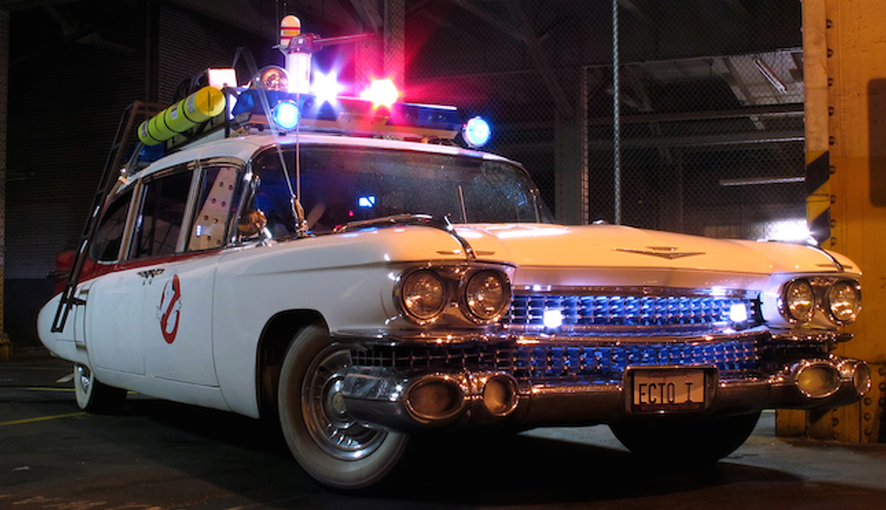

# ecto-1

<!-- markdownlint-disable MD033 -->
Peter: *"How's the grid holding up?"* 
Egon: *"Not good."* 
Winston: *"Tell him 'bout the Twinkie."* 
Peter: *"What about the Twinkie?"* ~ *Ghostbusters (1984)*

 *Old-school cool.*

Once I get the [Happy Little Cloud](hlc) in good working order, my plan is to finally replace my aging servers with some proper modern hardware. I didn't want to buy the hardware until I was sure I was ready, and finishing Happy Little Cloud is my litmus test.

## current servers

Here are the servers that I am planning to replace with the Ecto-1:

- `delorean`
  - my primary server for many years
  - started life as a Dell Inspiron 530 in 2008
  - Q6600 Core 2 Quad CPU with 4GB of RAM
  - previously hosted all of my services
  - hosted my public Minecraft server for years
  - still acting as a webserver and fileserver
- `yanosh`
  - an old gaming machine repurposed as a server
  - 1st-gen Core i7-860 CPU with 8GB of RAM
  - ran KVM running several virtual machines
  - hosted a DNS server and multiple game servers
  - system is offline as hardware is failing
- `stapler`
  - a mini-itx PC in a small-form-factor case
  - Ryzen 5 Q2400G APU with 16GB of RAM
  - formerly acted as my living room media server
  - currently acting as my Plex server
- `pihole`
  - my DNS sinkhole ad-blocking appliance
  - runs on a Raspberry Pi 4 4GB
  - acts as internal DNS for my network

I would like to repurpose `stapler` as a small gaming machine and finally retire `delorean` and `yanosh`.

## the name

*"Dr. Venkman, go... Yes I think go... Yes, the joyfulness is over!"* ~ Dr. Janosz Poha, *Ghostbusters 2*

 *A sensible guy to name a server after.*

As you might have noticed, all of my servers are named after people or props from my favorite movies and shows. Here's my running list so far:

- `delorean` - *Back to the Future* time machine
- `dodgson` - *Jurassic Park* character/[YTMND star](https://dodgson.ytmnd.com/)
- `yanosh` - *Ghostbusters 2* villain/comic relief
- `stapler` - red stapler from *Office Space*
- `gibson` - mainframe computer from *Hackers*
- `happy little cloud` - recurring character of *The Joy of Painting*

I wanted to keep the tradition going (especially with a memelord like ["yanosh"](https://www.youtube.com/watch?v=YL8sc3uJWSM)), and eventually settled on `ecto-1`, the iconic vehicle from Ghostbusters. The Ghostbusters themselves, `egon`, `peter`, `ray`, and `winston`, will be perfect names for the four nodes of the cluster.

## the plan

*"So why are you came?"* ~ Dr. Janosz Poha, *Ghostbusters 2*

Currently my goal is to complete work on the [Happy Little Cloud](hlc), as I will be deploying the Ecto-1 in the same manner with the same tech stack. If I can get everything sorted there first, I can hit the ground running with the more serious silicon.

Once I'm ready, I plan to build `egon`, the first of the four Ryzen nodes. I originally spec'd out the servers in 2022 with the following build in mind:

- 1U short-depth server case with HDD hot-swap module
- Ryzen 7 5700G 3.8GHz 8-core CPU
- 64GB DDR4-3600 RAM
- 2x TB Samsung 970 Evo Plus m.2 SSD
- 4x Seagate 5TB 2.5" 5400RPM HDD

I saved a [PCPartPicker](https://pcpartpicker.com/user/EagleRock/saved/#view=Csv4pg) for the curious.

Since the 7000 series of Ryzen processors are out and prices and availability has changed since 2022, I will need to refresh the hardware list and do a bit more research before going forward.

## cluster services

*"Soon, the city will be mine and Vigo's... Mainly Vigo's."* ~ Dr. Janosz Poha, *Ghostbusters 2*

I plan to host the following services:

- New `eagleworld.net` homepage & proxy
- Fileserver attached to HLC's NextCloud server
- [Plex server](https://www.plex.tv/) stack - video and audio sharing
- `old.eagleworld.net` - my old [BlazeBlogger](http://blaze.blackened.cz/) homepage
- `minecraft.eagleworld.net` - my old Minecraft server blog

I also hope to host several game servers as well:

- [Vintage Story](vintagestory.at) game server
- [Skyrim Together](https://skyrim-together.com/) game server
- [BeamMP](https://beammp.com/) game server
- [Satisfactory](https://www.satisfactorygame.com/) game server
- [My old Minecraft](http://minecraft.eagleworld.net/dynmap/aquilia/) game server
- [My old Tekkit](http://minecraft.eagleworld.net/dynmap/technia/) game server

As you can see, I have a lot in plan, stay tuned!
