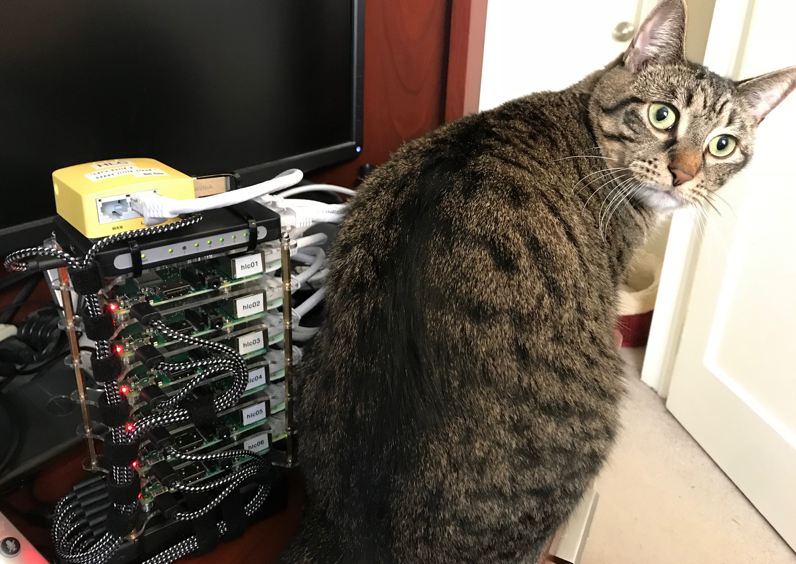
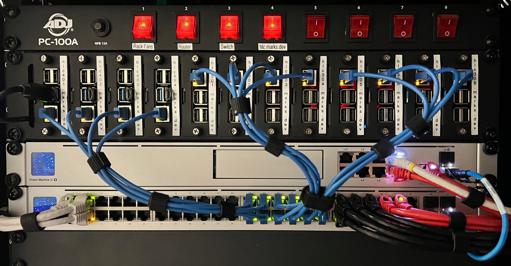

# happy little cloud

<!-- markdownlint-disable MD033 -->

[ *I quite literally took his advice.*](https://hlc.marks.dev)

## the idea

When I first started learning about Kubernetes, it was immediately fascinated by it and knew it was what I wanted to work on. I think the reason I like it so much is that it worked exactly how I thought clusters *should* work. From when I was very young and first learning about computers, I had this vague, mythical idea of how clusters and supercomputers worked, a bunch of systems magically working together as one.

Fast forward to around 2018, I had already been doing system administration for over a decade and was learning about DevOps tools and modern cloud architecture. When I started learning [Kubernetes the Hard Way](https://github.com/kelseyhightower/kubernetes-the-hard-way) and how all of the different components of Kubernetes worked together, it just *made sense.* The last time something made sense to me like that was when I first learned UNIX and subsequently Linux, so I knew Kubernetes was for me.

As to why it made so much sense to me, it was because all of its components are clearly there for *a reason.* To the untrained eye, the complex abstraction layer between computer and software can make Kubernetes seem like an overengineered solution to a problem that doesn't exist. In reality, it is a system administrator's best friend and sidekick. By that time, [plenty of other SREs](https://www.hanselman.com/blog/how-to-build-a-kubernetes-cluster-with-arm-raspberry-pi-then-run-net-core-on-openfaas) and [other DevOps-y individuals](https://itnext.io/building-an-arm-kubernetes-cluster-ef31032636f9) were already building their own home clusters, so I knew I wanted to give one a shot.

## the name

As to why I came up with the name, I was really into having Bob Ross on in the background at the time. His super-chill demeanor and relaxed painting style was the kind of vibe I needed. While [a particular episode was on](https://www.youtube.com/watch?v=kasGRkfkiPM), I happened to be [studying Kubernetes](https://www.classcentral.com/course/acloudguru-kubernetes-the-hard-way-103834/visit) and working on installing Kubernetes on some cloud playground servers.

When he mentioned "[building a happy little cloud](https://www.youtube.com/watch?v=kasGRkfkiPM&t=237s)," I had to stop and laugh at how coincidental it was, right down to the verb. Needless to say, when I started reading blog posts from SREs about building their own home clusters with Raspberry Pis, the name and the goal was clear.

## hlc mark 1

*The original version of Happy Little Cloud performing brilliantly as a cat butt warmer.*

>[!WARNING]
>I'm getting into the technical weeds here. Skip ahead to [this section](#cluster-services) to keep it light.

The first version of the Happy Little Cloud took advantage of a Raspberry Pi 6-node chassis, a miniature 8-port switch, 8-port USB hub, and mini WiFi router running OpenWRT. I based the cluster on Ubuntu 18.10, Microk8s, and Kubernetes 1.12. I was happy with how it turned out physically, because it was small and portable, and I could even bring it with me on vacation if I wanted to.

I was able to get a basic demo app on the cluster called [hlc-blinky](https://gitlab.com/eaglerock-hlc/hlc-blinky), which blinked the Raspberry Pi's power and activity LEDs to demonstrate the cluster's ability to manage and scale applications. However, I didn't get much more accomplished than this because I was unable to set up storage on the cluster.

As it turns out, Kubernetes was still fairly young in development and as a cloud-native application, it was not well-suited to running on baremetal hardware at the time. The few available built-in storage providers were cloud-specific, and while I had the idea to attempt GlusterFS as a solution, I was never able to get it working.

I must, however credit the original Happy Little Cloud for its dutiful services as light blinker and cat butt warmer.

## hlc mark 2

*Happy Little Cloud today in its happy little rack.*

When I decided to start working on the homelab, I wanted to cram as many Raspberry Pis as I could fit. The [12-node, 2U rack enclosure](https://www.amazon.com/gp/product/B098924W9M/ref=ppx_yo_dt_b_search_asin_title?ie=UTF8&psc=1) I found was perfect. I had the eight Pi 3's already and one RPi 4, but wasn't able to purchase the rest due to the global semiconductor supply-chain crisis at the time. I was also unable to find Ubiquiti devices in stock, so I had put the project aside for a while.

Eventually, the Ubiquiti hardware restocked at my local Micro Center, so I was able to source my network hardware as well as the RPi 4's I needed. After futzing with the network a bit, I was finally able to focus on deploying the cluster.

### cluster servers <!-- {docsify-ignore} -->

The twelve Raspberry Pis are clustered as follows:

| Node | Model | RAM | Role | Role |
|------|-------|-----|------|-------|
| `hlc-401` | RPi 4 | 4GB | `control` | `nfs` |
| `hlc-402` | RPi 4 | 4GB | `control` | `etcd` |
| `hlc-403` | RPi 4 | 4GB | `control` | `etcd` |
| `hlc-404` | RPi 4 | 4GB | `control` | `etcd` |
| `hlc-301` | RPi 3B+ | 1GB | `worker` ||
| `hlc-302` | RPi 3B+ | 1GB | `worker` ||
| `hlc-303` | RPi 3B+ | 1GB | `worker` ||
| `hlc-304` | RPi 3B+ | 1GB | `worker` ||
| `hlc-305` | RPi 3B+ | 1GB | `worker` ||
| `hlc-306` | RPi 3B+ | 1GB | `worker` ||
| `hlc-307` | RPi 3B+ | 1GB | `worker` ||
| `hlc-308` | RPi 3B+ | 1GB | `worker` ||

The Raspberry Pi 3's are really low on RAM, but are great for now with lightweight webserver loads, and can be replaced with more RPi 4's or RPi 5's down the line.

### cluster storage <!-- {docsify-ignore} -->

The following storage is being used for the cluster:

- 32GB Class 10 SD cards used for the root filesystem of all RPis
- 4 64GB USB3 thumb drives used as the cluster filesystem for RPi 4s
- 1 240GB solid-state drive mounted to `hlc-401` as a cluster NFS share

The solid-state drive is obviously a single point of failure, but my current options for storage are limited, as the only USB 3 ports are available are 2 per Raspberry Pi 4.

Down the line, once I have some Raspberry Pi 5's in place, I plan to leverage [Longhorn](https://github.com/longhorn/longhorn) to create distributed block storage over USB 3 or PCIe.

### tech stack <!-- {docsify-ignore} -->

Here is the current tech stack:

- Debian 12 Bookworm
- Ansible for baremetal server configuration
- k3s lightweight Kubernetes bundle
- running kubernetes version 1.28.4
- High-availability etcd cluster data store
- NFS (network file system) server on `hlc-401` for cluster volumes
- nfs-subdir-external-provisioner storage provisioner
- Traefik Ingress & web reverse proxy
- ServiceLB NodePort load-balancing
- cert-manager for automated TLS certificate management
- ArgoCD for automating servers and infrastructure-as-code

## cluster services

### current services <!-- {docsify-ignore} -->

The following services are running on Happy Little Cloud right now:

- [marks.dev](https://marks.dev) - :cloud: Coming to you live from the Happy Little Cloud
- [hlc.marks.dev](https://hlc.marks.dev) - :paintbrush: Gotta spread the Bob Ross love with a single-serving website
- mr-poopybutthole - :trollface: meme sharing and troll bot for my Discord server

### upcoming services <!-- {docsify-ignore} -->

The following services are also planned for Happy Little Cloud:

- Prometheus metrics gathering
- Grafana data visualization & dashboards
- Bind9 internal recursive DNS server
- Pihole DNS sinkhole
- Dynamic DNS management service
- Cloud services through NextCloud server
- Upptime status page

Once the above services are online, I will be able to migrate off of Google Drive and start getting my digital life in order.

## future plans

Once I finish building out HLC mk2, I plan on moving to  building the [ecto-1](ecto-1) cluster and finish replacing my old servers.

### hlc mark 3 <!-- {docsify-ignore} -->

As far as Happy Little Cloud, here are some plans for mk3 so far:

- upgrade to Raspberry Pi 5's once available
- replace all Raspberry Pi 3's with newer models
- replace SSD with fast USB drives and clustered storage
- deploy webgames such as [tomeclicker](code/?id=tomeclicker)
