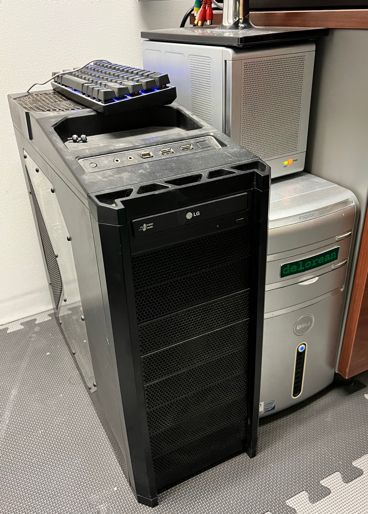

# homelab

<!-- markdownlint-disable MD033 -->

*The obligatory Hollywood Shot* :tm:.

I've been wanting to upgrade my homelab for a while. After getting my home wired with Ethernet during renovations, I had an opportunity to redo my entire home network from scratch, and wanted to build it out as professionally as I could. Most of my professional work has had to cut corners somewhere for practical business reasons, but I could do this without a timeline, other than replacing my current aging servers before they beep their last boop.

## the idea

I'm very much a fan of building things in a compact and efficient manner, especially since a full-length 42U server rack would be a logistical nightmare to fit in my basement. Instead, I wanted to go for something short-depth and possibly wall-mounted. After searching online for what was available and weighing the options, I settled on the following setup:

- [NavePoint 9U short-depth wall-mount rack](https://navepoint.com/navepoint-9u-600mm-depth-networking-cabinet-performance-series/)
- [15 amp, 8 slot power distribution unit](https://www.amazon.com/gp/product/B00KFZ98YO/ref=ppx_yo_dt_b_search_asin_title?ie=UTF8&psc=1)
- [Ubiquiti Dream Machine SE](https://store.ui.com/us/en/collections/unifi-dream-machine)
- [Ubiquiti Pro 48 Layer 3 Switch](https://store.ui.com/us/en/collections/unifi-switching-pro-ethernet)
- [12-node Raspberry Pi Kubernetes Cluster](https://www.amazon.com/gp/product/B098924W9M/ref=ppx_yo_dt_b_search_asin_title?ie=UTF8&psc=1)
- [4-node Ryzen 7 based Kubernetes Cluster](https://pcpartpicker.com/user/EagleRock/saved/#view=Csv4pg)
- [APC Back-UPS Pro 1500VA Uninterruptable Power Supply](https://www.apc.com/us/en/product/BN1500M2/apc-backups-pro-1500va-tower-120v-10-nema-515r-outlets-lcd-1-usb-type-c-+-1-usb-type-a-ports/)

The specs have been tweaked throughout the process (especially the network hardware), and the hardware list needs to be refreshed for 2024, but the plan essentially remains the same.

## the migration

 *Delorean today, running 15 years and counting.*

Prior to the project, I had the following servers at home:

- `delorean` - my oldest server, still running my fileserver, reverse proxy, and some webservers
- `yanosh` - an old gaming computer turned KVM hypervisor, shut down due to system failures
- `stapler` - my Plex server formerly serving double-duty as a living-room set-top PC
- `pihole` - a Raspberry Pi 4 working as my internal DNS and DNS sinkhole adblocker

My motivation for this project can be boiled down to two things:

1. replace the above servers before they meet the great daemon in the sky
2. lock down the ever-increasing number of insecure smart devices in my home

## the goals

*The server rack today, its UPS, and* `stapler`.

As such, my migration goals became the following:

- install a proper rack for all my servers
- remove single points of failure where possible
- upgrade my home network hardware
- build out multiple virtual networks (VLANs)
- isolate my growing list of IoT (Internet-of-Things) devices
- deploy Happy Little Cloud mk2, a 12-node Raspberry Pi Kubernetes Cluster
- deploy basic network services to HLC mk2
- prove out my home tech stack
- deploy first node of Ecto-1, a 4-node Ryzen-based Kubernetes cluster
- migrate remaining services to Ecto-1
- repurpose `stapler` as spare gaming PC
- decomission `delorean`, `yanosh`
- [???](https://www.youtube.com/watch?v=a5ih_TQWqCA)
- profit!

Delorean has served me well for many years and has had all of its RAM and hard disks replaced at least once at this point. I'm just hoping it'll hold out until I'm ready to buy the replacement hardware. :crossed_fingers:

Honorable mention to Yanosh still hanging in there as Delorean's official keyboard stand! :1st_place_medal:

## network

> [!NOTE]
> I'm still in the process of finishing the network configuration and will write this out when done!

I'll write up some more details on how I built out the network later. In the meantime, check out how I started building the [happy little cloud](hlc)!
