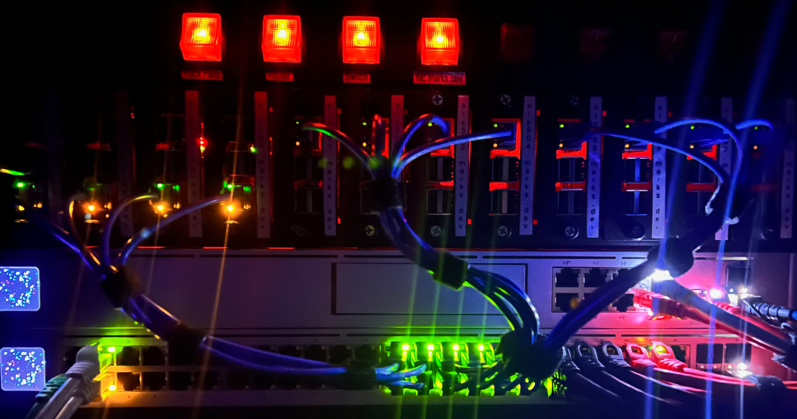
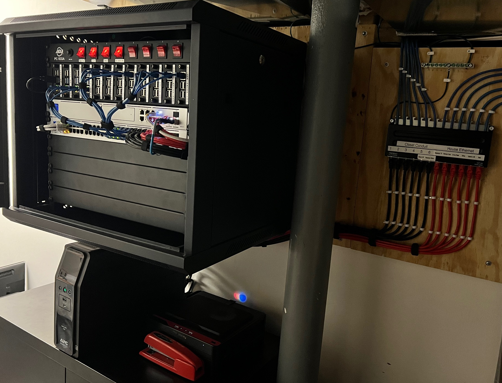
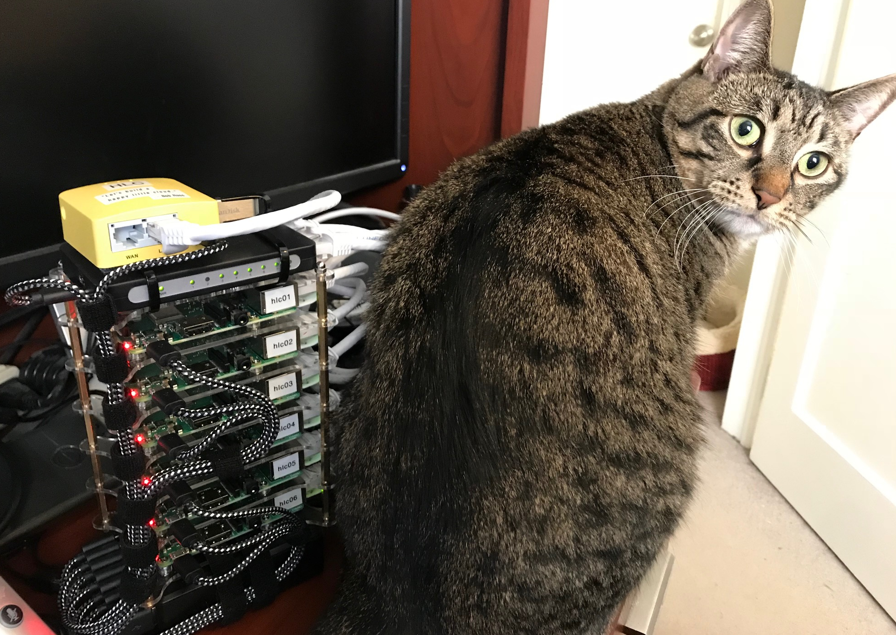
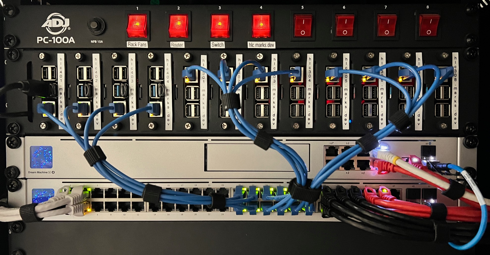

# homelab

<!-- markdownlint-disable MD033 -->

I've been wanting to upgrade my homelab for a while. After getting my home wired with Ethernet during renovations, I had an opportunity to redo my entire home network from scratch, and wanted to build it out as professionally as I could. Most of my professional work has had to cut corners somewhere for practical business reasons, but I could do this without a timeline, other than replacing my current aging servers before they beep their last boop.

## the plan

I'm very much a fan of building things in a compact and efficient manner, especially since a full-length 42U server rack would be a logistical nightmare to fit in my basement. Instead, I wanted to go for something short-depth and possibly wall-mounted. After searching online for what was available and weighing the options, I settled on the following setup:

- [NavePoint 9U short-depth wall-mount rack](https://navepoint.com/navepoint-9u-600mm-depth-networking-cabinet-performance-series/)
- [15 amp, 8 slot power distribution unit](https://www.amazon.com/gp/product/B00KFZ98YO/ref=ppx_yo_dt_b_search_asin_title?ie=UTF8&psc=1)
- [Ubiquiti Dream Machine SE](https://store.ui.com/us/en/collections/unifi-dream-machine)
- [Ubiquiti Pro 48 Layer 3 Switch](https://store.ui.com/us/en/collections/unifi-switching-pro-ethernet)
- [12-node Raspberry Pi Kubernetes Cluster](https://www.amazon.com/gp/product/B098924W9M/ref=ppx_yo_dt_b_search_asin_title?ie=UTF8&psc=1)
- [4-node Ryzen 7 based Kubernetes Cluster](https://pcpartpicker.com/user/EagleRock/saved/#view=Csv4pg)
- [APC Back-UPS Pro 1500VA Uninterruptable Power Supply](https://www.apc.com/us/en/product/BN1500M2/apc-backups-pro-1500va-tower-120v-10-nema-515r-outlets-lcd-1-usb-type-c-+-1-usb-type-a-ports/)

The specs have been tweaked over time

## rack & network

The goal is to set up the network and the RPi cluster first, followed by the first of the four Ryzen 7 nodes. Each of the 4 nodes will have the following:

- 1U short-depth server case with HDD hot-swap module
- Ryzen 7 5700G 3.8GHz 8-core CPU
- 64GB DDR4-3600 RAM
- 2x TB Samsung 970 Evo Plus m.2 SSD
- 4x Seagate 5TB 2.5" 5400RPM HDD

I have a [PCPartPicker](https://pcpartpicker.com/user/EagleRock/saved/#view=Csv4pg) for those like-minded individual who appreciate all the details :smile:

## happy little cloud

*I quite literally took his advice.*

When I first started learning about Kubernetes, it was immediately fascinating to me, as it made sense to me. Even when I was young and was learning how clusters and supercomputers worked, I had an idea of how it would work, and Kubernetes just fits it. As a professional who has been working on production Linux systems for over a decade, Kubernetes was the answered prayers of system administrators worldwide. I knew I wanted to build a cluster, and Kubernetes was the way.

In terms of hardware, the rise of the Raspberry Pi as an inexpensive Linux system made building a computer cluster a realistic option. Plenty of other SREs and other DevOps-y individuals were already building similar clusters, so I wanted to give mine a shot.

### hlc mark 1

*The original version of Happy Little Cloud performing brilliantly as a cat butt warmer.*

The first version of the Happy Little Cloud took advantage of a 6 Raspberry Pi cluster chassis, a miniature 8-port switch, 8-port USB hub, and mini WiFi router running OpenWRT. I based the cluster on Ubuntu 18.10, Microk8s, and Kubernetes 1.12. I was happy with how it turned out physically, and I was able to get the cluster running with a basic demo.

My first demo app on the cluster was [hlc-blinky](https://gitlab.com/eaglerock-hlc/hlc-blinky), which blinked the Raspberry Pi's power and activity LEDs to demonstrate the cluster's ability to manage and scale applications. However, I didn't get much more accomplished than this because I was unable to set up storage on the cluster.

As it turns out, Kubernetes was still fairly young in development and as a cloud-native application, it was not well-suited to running on baremetal hardware at the time. The few available built-in storage providers didn't provide a good option, and while I had the idea to attempt GlusterFS as a solution, I was never able to get it working.

### hlc mark 2

*Happy Little Cloud today, made up of 4 RPi 4's and 8 RPi 3's.*

When I decided to start working on the homelab, I wanted to cram as many Raspberry Pis as I could fit. The 12-node, 2U rack enclosure was perfect. I had the eight Pi 3's already and one RPi 4, but needed some time to fill out the rest of the cluster, thanks to the semiconductor supply chain crisis. By the time the Ubiquiti hardware was available at my local Microcenter, so was the Raspberry Pi 4's I needed.
