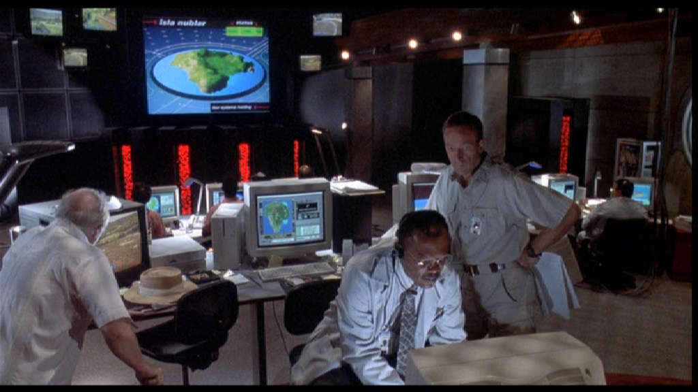
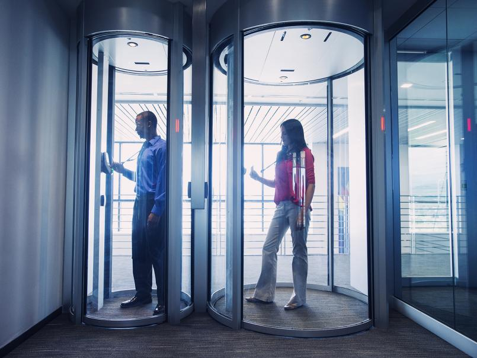

# story time

<!-- markdownlint-disable MD033 -->
*"Spared no expense."* ~ John Hammond, *Jurassic Park*

*"Don't get cheap on me, Dodgson. That was Hammond's mistake."* ~ Dennis Nedry, *Jurassic Park*

I definitely have my share of stories from my time in the trenches. I'll share them along as I think of them.

## hollywood lights

**What the hell are Hollywood Lights:tm:?**

 *[Hold on to your butts](https://butt.holdings).*

In around the year 2013, I was put in charge of running a small 8-rack cage in a colocation data center in Parsippany. It was recently opened, had state-of-the-art security, and made sure you *knew* it. Here's what it took to get inside the cage:

1. Arrive at a building with zero outdoor signage
2. Use personal access card to open front door
3. Scan card to enable biometric eye scanner on wall
4. Scan eyes to ensure my eye match what is on file
5. Wait for outer mantrap door to open
6. Enter mantrap door, wait for door to automatically close
7. Enter 4-digit personal PIN to enable biometric scanner
8. Scan right index finger print on biometric scanner
9. Wait for inner mantrap door to open
10. Enter data center, use access card to open cage
11. Finally go and do all the computery thingies

 *An example of some mantrap doors.*

One day, I was working in the company cage as normal when all of the lights suddenly go out. It wasn't a big deal, as each cage had its own light on a timer, but it was unexpected in the middle of the day. Then, a few seconds later, the entire data center is bathed in deep blue light.

Once my eyes adjusted to the eye-piercing blue, I noticed the row of blue incandescent lamps along the data center wall as the manager walked by with a few people in suits in tow. I shrugged it off and kept working until the lights went back to normal about 10 minutes later.

 *Like this, but **way** [bluer](https://www.youtube.com/watch?v=4iwHb189X84).*

Later on that day, I ran into the manager and asked him what the lights were all about. He said, "Oh, those? Those are the Hollywood Lights:tm:. Whenever we have prospective clients and have the executives come in for a tour, they don't really know what they're looking at. So we use the Hollywood Lights:tm: to make it look cool and futuristic to them so they sign with us."

I learned a valuable lesson that day: you could build the best data center there is with the best security money can buy, design the most resilient and powerful cluster, or write the perfect application that does exactly what it needs to do, but at the end of the day, it all comes down to [Hollywood Lights](homelab):tm:.

