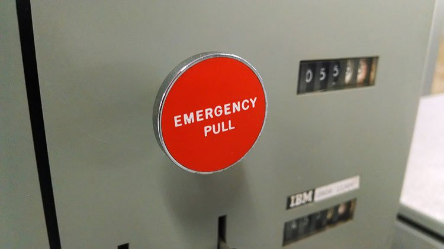
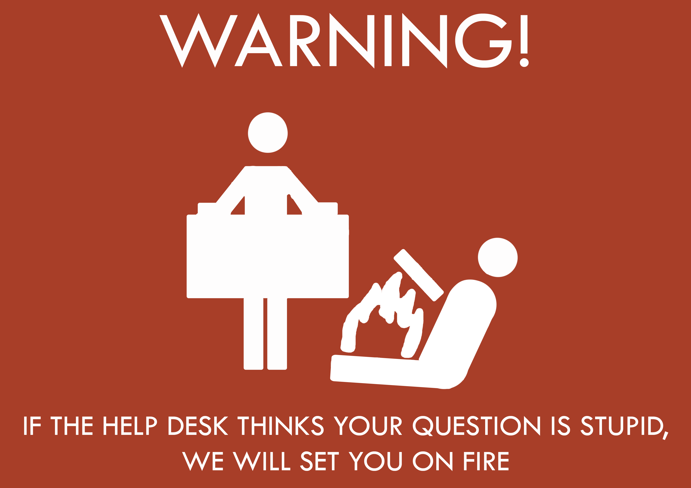

# story time

<!-- markdownlint-disable MD033 -->
*"Spared no expense."* ~ John Hammond, *Jurassic Park*

*"Don't get cheap on me, Dodgson. That was Hammond's mistake."* ~ Dennis Nedry, *Jurassic Park*

I definitely have my share of stories from my time in the trenches. I'll share them along as I think of them.

## hollywood lights

**What the hell are Hollywood Lights:tm:?**

 *[Hold on to your butts](https://butt.holdings).*

In around the year 2013, when [advice animals](https://knowyourmeme.com/memes/advice-animals) roamed the Internets, I was put in charge of running a small 8-rack cage in a colocation data center in Parsippany. It was recently opened, had state-of-the-art security, and made sure you *knew* it. Here's what it took to get inside the cage:

1. Arrive at a building with zero outdoor signage
2. Use personal access card to open front door
3. Scan card to enable biometric eye scanner on lobby wall
4. Scan eyes to ensure my eye match what is on file
5. Wait for outer mantrap door to open or try again
6. Enter mantrap door, wait for door to automatically close
7. Enter 4-digit personal PIN to enable biometric finger scanner
8. Scan right index finger to ensure it matches what is on file
9. Wait for inner mantrap door to open or try again
10. Enter data center, use access card to open cage
11. Finally go and do all the computery thingies

 *An example of some mantrap doors.*

One day, I was working in the company cage as normal when all of the lights suddenly go out. It wasn't a big deal, as each cage had its own light on a timer, but it was unexpected in the middle of the day. Then, a few seconds later, the entire data center is bathed in deep blue light.

Once my eyes adjusted to the eye-piercing blue, I noticed the row of blue incandescent lamps along the data center wall as the manager walked by with a few people in suits in tow. I shrugged it off, turned the cage light on, and kept working until the lights went back to normal a few minutes later.

 *Like this, but **way** [bluer](https://www.youtube.com/watch?v=4iwHb189X84).*

Later on that day, I ran into the manager and asked him what the lights were all about. He said, "Oh, those? Those are the Hollywood Lights:tm:. Whenever we have prospective clients and have the executives come in for a tour, they don't really know what they're looking at. That's when we turn on the Hollywood Lights:tm: to make it look cool and futuristic so they sign with us."

I learned a valuable lesson that day: you could build the best data center there is with the best security money can buy, design the most resilient and powerful cluster, or write the perfect application that does exactly what it needs to do, but at the end of the day, it all comes down to [Hollywood Lights](homelab "Back to the homelab page"):tm:.

## just a directory command

 Production is *not* the best place to get curious.

Back in the year 2011, the year that famously brought us [planking](https://knowyourmeme.com/memes/planking), I was working in a global network operations center for a low-latency money market trading platform. This involved literally hundreds of servers responsible for connecting all parties worldwide. This was accomplished by letting clients connect to one of dozens of broker servers across 6 worldwide data centers, while active trades and arbitration were handled on a single VAX server running VMS. This single server was in one of six primary data centers across 3 regions (New York, London, and Singapore) and did a follow-the-sun rotation to follow where peak trading traffic occurred. Needless to say, if something bad happened to this one server, all trading was affected worldwide, so that was an all-hands-on-deck, money-hemorrhaging, "we gotta fix this now" kind of event that senior leadership paid close attention to, and rightfully so since our SLAs were very strict.

If you aren't familiar with low-latency trading and what goes into it, I can best give you the vibe by paraphrasing how one of the grizzled, heavily-bearded system architects of this platform described to me how the servers were spec'd out and why they were so large and expensive:

> "You may notice that even at peak load times our servers barely get over 5% CPU load. It's not an accident that these systems are as underused as they are. Basically, we figured out how much computing power we needed, then we basically added a zero. This would ensure that even at peak time, the systems were only running at a 10% load. Why? Because if you run a system at a 90% load, while you in theory shouldn't have any problems, there will be hiccups. All it takes is a single kernel thread to hang for a second or a tiny bit of iowait to cause a split-second delay in a production service.
>
> "Those occasional hiccups don't matter much to most business, but we aren't working with normal people. We are working with day-traders that are literally trading millions of dollars trying to beat someone else out within milliseconds. These are guys who essentially grew up playing first-person shooters who have reaction times that are insane. I remember meeting these guys on-site when a trader was trying to point out trading delays we couldn't see. I can show you the video we recorded of this guy pointing out trading delays that were less than 50 milliseconds, and that bit of time can make a huge difference in making a trade.
>
> "When a megacorp is trading billions of dollars in a single transaction, just one delay can lose ridicuous sums of money. So our clients really care about our system working and we have strict SLAs to reflect that. Too many slow trades and our clients use our platform for free for the entire day. Therefore, we need our machines to be ridiculously overpowered for the job and barely working, because it needs to work every single time."

The team I worked on at the time was a group of 8 sysadmins that worked in a 12-hour shift rotation. Because my team was an escalation layer and only had about an hour or two of non-incident work a day, the night shift could drag on for hours with literally nothing happening. As you can imagine, just staying awake was part of the challenge of the job. The other challenge, however, was being ready for when *shit goes down*. The workload was light because we were essentially being paid to do the right thing at the right time, every time.

One night, I was working the night shift on an unparticularly boring evening. During downtime, it was pretty common for us to train and practice to stay alert and to stay crisp with all critical procedures. That night, we had a third sysadmin learning on the job from myself and another experienced admin. At this point, he was working for about a month and pretty much kept quiet and to himself. The only thing that had stood out to me about him was that when he spoke about the Ctrl+Alt+Delete command, he pronounced it "Control Alternate Delete," which...was a first for me.

By this point, it was early morning, during the height of trading in Asia, and it had been quiet all night. Suddenly, our monitoring TVs all lit up with red critical alarms. These were alarms I had never seen before after over a year of working there, and I saw they were for the active arbitrator. The manager on duty and I lock eyes, and I said "yep, we're gonna need a bridge...this looks like a big one." I immediately get my headset and start calling out loud that I am logging in to check, when the new hire taps my arm and says, "There's no need. That was me."

I stop and look at him, puzzled. He says, "I was running a `DIRECTORY` command. I stopped it." At this point, I look back at my computer and all of the alarms have stopped. At this point, the manager on duty is involved, who already raised the bat signal to upper management and started an incident bridge. At this point, we had a bunch of slow trades, which undoubtedly had put us under SLA level with a bunch of our clients. Ballpark estimation after the fact was lost revenue on the order of over $150,000 from this one incident. So, this put us all in a pretty big predicament.

Since this was the early 2010s and blameless engineering culture hadn't exactly hit the world of finance, and since this kind of mistake could cost the company multiple times our yearly salary, this little oopsie could result in immediate termination. Since the manager on duty was an empathetic type and didn't want to let the [FNG](https://en.wikipedia.org/wiki/FNG_syndrome) take the fall in his first month, we all agreed to call the incident a monitoring glitch and to let lessons be learned. I had my personal reticence to the arrangement, but also agreed that a guy shouldn't be terminated for one stupid mistake, especially if it's the kind someone does once and never again.

After a lengthy phone conversation on the incident bridge, we all were able to hang up and relax for a bit before the transition to the London data center. At some point, the new guy turns to me and says "I don't get what all the fuss was about. I was just running a `DIRECTORY` command." At this point I almost see red. I couldn't believe that this guy said this to me, especially after a long conversation with senior management grilling about the alarms. I end up saying, "What were you doing that for in the first place?" He responds, "I was just playing around trying to look around the filesystem."

I was very quickly losing professional respect for this guy at this point. Not only did he seem to not care about something that literally everyone else in the room cared about, it was clear to me he didn't understand the technical ramifications of his actions. The reason I say this is because he was trying to play around on the server to understand it, and out of the 6 servers online (active/passive pair per data center), he decides to log in and play around on the *active* server in the *active* data center. Literally out of 6 servers, he decides to do this on the only one in the world is making money for the company at that point in time. I then respond back a bit more heatedly. "You're scanning a filesystem on a live arbitrator. That could've affected thousands of trades with iowait in that time. You can't run a command like that on a heavily loaded system and not expect it to do something!" He responds back, "It was just a `DIRECTORY` command."

That pretty much ended the conversation for me and threw all professional respect I had for this person out the window permanently. Not only did he not care about how this affected the company, he didn't care at all about learning from the mistake or even why people were upset about his actions. As someone who hasn't forgotten what it's like to be a beginner at this trade, I always believe in giving someone a second chance, especially if they are eager and willing to learn. However, if you're never going to learn and just make the same mistakes, you're not worth putting time into.

I also don't like to blame people for mistakes in general, because it doesn't really do anything. Leave the job performance stuff to managers in one-on-one meetings. As for my job and the infrastructure, I don't care if you accidentally pull the `EMERGENCY PULL` button that powers off the mainframe and costs the company hundreds of thousands of dollars. I would rather everyone fess up and we talk about what happened, so we can figure out a preventative solution going forward. For example, why the hell do we need a giant `EMERGENCY PULL` power killswitch on the mainframe that could so easily be accidentally pulled by an otherwise smart engineer?

So while he got away with it and that colleage became a thorn in my side for a good amount of time, I learned two lessons from this scenario: The first was how crippling a toxic, blame-game, CYA culture can be to an engineering org. You never get the real facts and can't really solve problems because it's in everyone direct interest to not get fired and to not tell the truth.

The second lesson was a bit simpler: even though most engineers in this field are generally smart, curious, and are constantly improving themselves, *some people just can't be taught a damn thing.*

## names are hard

 A friendly reminder from your friendly neighborhood help desk.

You would think memes like this one are a bit extreme, but the help desk industry didn't get its burly, mean-tempered reputation out of nowhere. Sometimes, some people just really make you question humanity.

Way back when in the year 2007, the same year that brought us [keyboard cat](https://www.youtube.com/watch?v=J---aiyznGQ), I was working on a help desk for CRM software used by pharmeceutical sales reps. As you can expect from the clientele, the level of computing experience with this bunch was...dubious at best. The company we were supporting just hired a new bunch of representatives who were all getting onboarded with laptops.

Since my company provided the laptops, we had access to one of their Active Directory servers that was used for provisioning the laptops and troubleshooting on our side. The week was flooded with calls for the usual rollout pains that go hand in hand with help desk work.

One particular user by the name of Jeffery called up the help desk as a new hire who couldn't log on to his new laptop. I start to troubleshoot the issue with him and, in a practice that was standard at the time but would make me cringe today, I requested his password as given to him in the package and attempted to log on with his account on our test server.

The email accounts for this company were `lastname.firstname@company.com`, so I enter his username as normal. Assuming this guy's last name was Smith, and assuming we are in the movie Office Space, it would've been `smith.jeffery@initech.com`. I then enter his password and was able to log in successfully.

At this point I'm confused, and say out loud on the call, "Huh, the login worked on my side...not sure what's going on." Jeffery then exclaims, "OH! I know what's wrong! I've been spelling my name as J-E-F-F-R-E-Y." I then say, "Oh, is your name misspelled? I should be able to get that fixed for you."

This guy's response absolutely floored me, that to this day, I still don't believe it. Here it is, in verbatim:

>"No, my name is spelled correctly. However, most people spell Jeffrey with R-E-Y, so I type it like that because it would log me on better that way."

At this point, with my head *literally* in my hands, I have to ask this guy, "Can you please try spelling your name correctly?" After a few seconds, he remarks "Yes! That worked! Thanks so much for your help!"

So yeah, names are hard.
