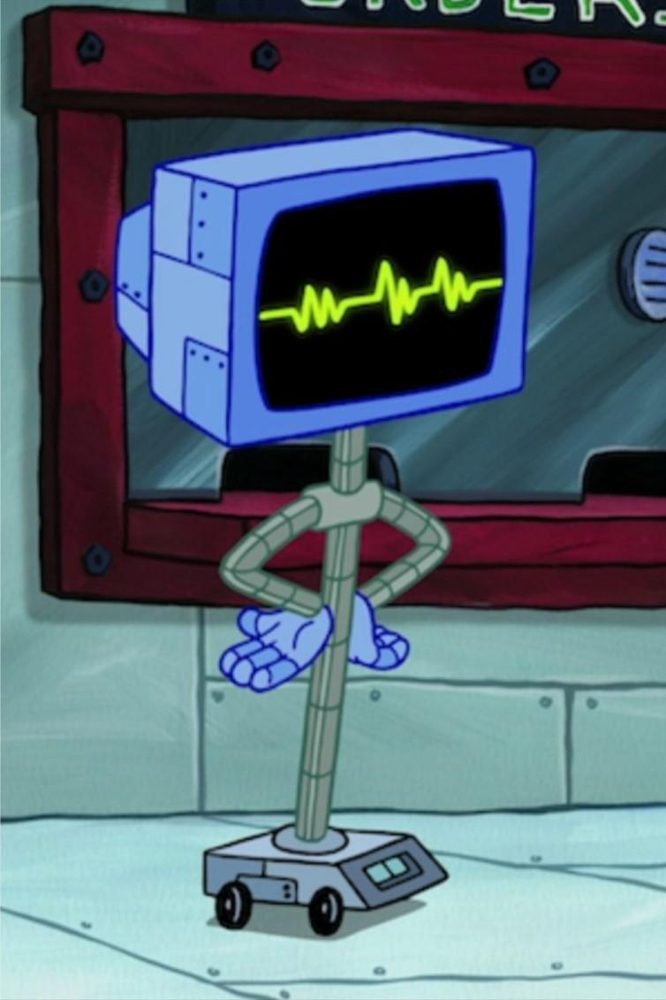
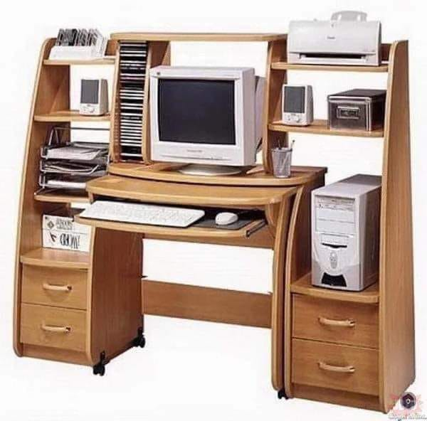

# on computers

Some thoughts on computers in general in an ever-shifting digital world.

*"Nagging Software? I heard that! Come back here and dust my screen!"* ~ Karen, *Spongebob Squarepants*

## computers today

<!-- markdownlint-disable MD033 -->

 *Plankton was doing the AI girlfriend thing a long time ago.*

In today's world, computers are ubiquitous on a level never seen before. Not only do we all have computers in our pockets that contain more computing power than all of NASA had available during the Apollo space missions, we now have to listen to the incessant murmurings about AI taking over the world in unknown, scary, dubious, and conspiritorial ways. You can't get away from it, especially if you pay attention to the hot garbage spewing out of social media these days.

This flies in the face with my own worldview on computers, which is much more idealistic (and optimistic), but comes from a different time and a different world. As an [Elder Millennial](https://www.youtube.com/shorts/qIzaC5Hvj4I), I can remember when computers were, quite simply, *cool*. It seems almost ridiculous to talk about computers being cool, but they were at the time.

## early personal computers

Computing in the 90s was definitely the heyday of the Internet, as this is when the general populace (at least in the US where I live) started to slowly but surely come online. This time period was in the twilight of the hobbyist era of computers which originated in the late 70s and early 80s as the first microprocessors became available and spearheaded the 8-bit generation of computers. This was a time that I missed out on but certainly have [many](https://github.com/eaglerock1337/spectrum) [personal](https://github.com/eaglerock1337/qbasic) [coding](https://github.com/eaglerock1337/rc2014) [projects](https://github.com/eaglerock1337/agon-stuff) that spark joy from programming on 8-bit computers that either came from or were inspired by this hobbyist era. As a child of the 90s, though, I was firsthand witness of the rise of computers in the hands of the general populace and the Internet becoming a daily occurrence in people's lives, and have enough memories of life before this time to give me both the Generation X and Millennial take on the world.

> The quickest way to describe the Xennial experience is this: I remember a time of unsupervised childhoods and [library card catalogues](https://en.wikipedia.org/wiki/Library_catalog), but also grew up around the helicopter parenting movement and all the computer stuff, too.

## the 90's computing experience

The early form of the Internet that survived the 90s and the early 2000s was a unique world with a charm that can't really be expressed today. Today's Internet is so rife with ads, notifications,  corporate interests, and other nonsense that you can't really replicate that feel of the old-school Internet without relegating yourself to browsing the web on a computer and basically ignoring your smartphone. Going on the computer back in the 90s wasn't just something you did, it was an *event*. And that event started with visiting the Shrine of Our Lady of Computation that most families worshipped in some form.

<!-- markdownlint-disable MD033 -->

[ *Our Lady of blessed computation, don't fail me now!.*](https://www.youtube.com/watch?v=KXfUcY5r3aU)

So yeah, right from the get-go, you didn't just "go on the Internet," you had to decide it was time to use the computer, and you had to go to the area in your house devoted to the computer. Since most Internet connections in the 90s were [dial-up connections](https://en.wikipedia.org/wiki/Dial-up_Internet_access), that also meant taking over the telephone for as long as you were connected, much to the chagrin of your family members who wanted to use the telephone for telephone things.

This involved not just booting up the computer (which in the days of slow spinning hard-drives could take several minutes), but also connecting to your ISP through your modem. Not only did you get to deal with the slowness of your own computer, but you also had to contend with your ISP having enough open phone lines to establish your connection. To give you a feel of what that was like, let me set the scene for you.

### snow day

It's January in 1998, you're in high school, and you wake up to it snowing. Naturally, as with any kid from any time frame, your first thought is, "Is it a snow day???" However, since we are well before the time that school closure information was easily found on the Internet or via a robocall, we had to find out the old-school way: listening to a specific radio station and waiting for when they announced school closures in the area. So there the family sat, sitting around the kitchen table where the radio was placed as we patiently waited for the closure announcements. Then, as the announce rattled off the names of the school districts having delayed openings or closures, you waited to hear the name of your district, until finally it was announced.

Thus began the race: since you and every student in your school was listening to the same exact radio station listening for the same exact announcement, as soon as you knew it was a snow day, you had to rush over to the computer desk, switch on your computer, and try to connect to your ISP before everyone else in your school tried to do the same thing. All of this was so that you could kick back and relax, browse the World Wide Web a bit, and chat with your friends on AIM, MSN, ICQ, or whatever was your instant messenger of choice back in the day. Doing this, however, meant you had to catch one of the open phone lines to your dial-up ISP (America Online, CompuServe, NetZero, Juno, etc.) and have your modem make the magic noises to turn your phone into an Internet conection. If you were slow on the draw, though, it could take you as long as a half-hour of being stuck in a loop of trying to connect, only to get hit with a busy signal and needing to try again.

This was the computing experience of the day: slowly becoming ubiquitous, but still decoupled from daily life in the sense that you not only needed to make the conscious shift to using the computer at some point in the day, but you had to be in a specific place in your house to do it, and you had to share it with the rest of the family. This meant that every computing experience was, at some level, intentful, because it wasn't immediately available.

### surfing the web

When you combine the ritualistic procedure of getting online with the fact that this technology was new to everyone, children of the 90s naturally gravitated towards playing around with computers and living in a world that their parents probably didn't really understand. Even my father, a self-taught mechanic with an impressive intuitive understanding of all things mechanical, found computers to be his kryptonite, as he couldn't begin to understand it. A computer was too different to anything else the Boomer generation had seen, so there was a huge knowledge gap between those that got it and those that didn't, and those that did get it were few and far between.

Even hearing the Internet mentioned at all in mainstream media was unusual and noteworthy, and usually [hilarious](https://www.youtube.com/watch?v=kkAngvkWVkk), because newscasters and "normies" really didn't know what they were talking about, and their reporting on it was usually quite cringe. However, even just hearing the Internet mentioned at all on the news was exciting, because it was a blip of acknowledgement of the growing digital world that Millennials grew up in. This meant that computers and the Internet had even more of a mystique surrounding it than you would expect, which only increased the cool factor for the 90's youth.

## back to today

Compare this experience with today's Internet: if you're not actively getting push notifications from whatever app is vying for your attention on your smartphone or smartwatch, you are a hand gesture away from access to the sum of all human knowledge on the Internet. There's zero overhead to getting that same Internet connection that took consideration and intent 30 years ago. As far as the news and mainstream media goes these days, *not* hearing about computers and AI is more surprising than hearing the usual "AI is gonna take your jobs" doom-mongering.

As far as today's Internet goes, it's not nearly what it once was. Besides the fact that [most of what you see on social media is AI-generated](https://www.forbes.com/sites/bernardmarr/2025/03/10/15-mind-blowing-ai-statistics-everyone-must-know-about-now/), apps, websites, and everything in between are getting [enshittified](https://en.wikipedia.org/wiki/Enshittification) faster than ever. This isn't just driven by corporations who try to squeeze every bit of value out of their customers, it's also helped along by AI-assisted coding hurting the platforms we rely on, [even the AI platforms themselves](https://www.theregister.com/software/2026/04/13/claude-is-getting-worse-according-to-claude/5219923).

Needless to say, there's plenty of argument to be made as to why Millennials will be the last generation that understands computers on the level that we do: there's no real incentive for anyone else to try or even care. Even if you are the kind of person who likes computers. Even the lucrative software engineering roles are under threat from companies claiming that AI will remove the need for software engineers in the future.
